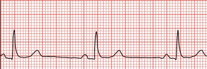
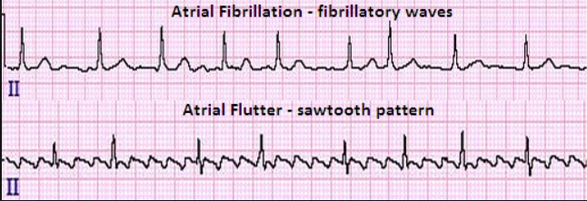
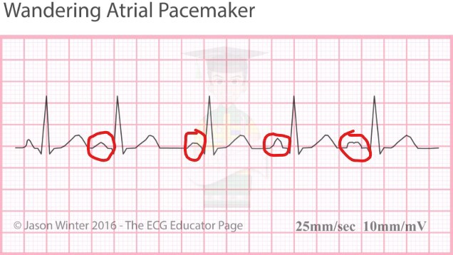
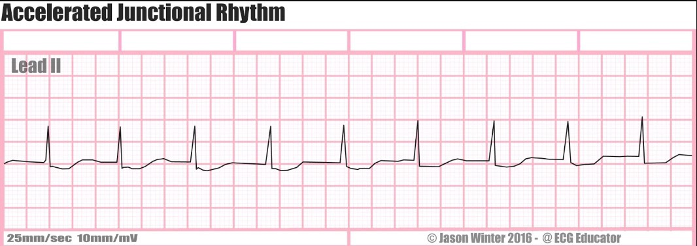
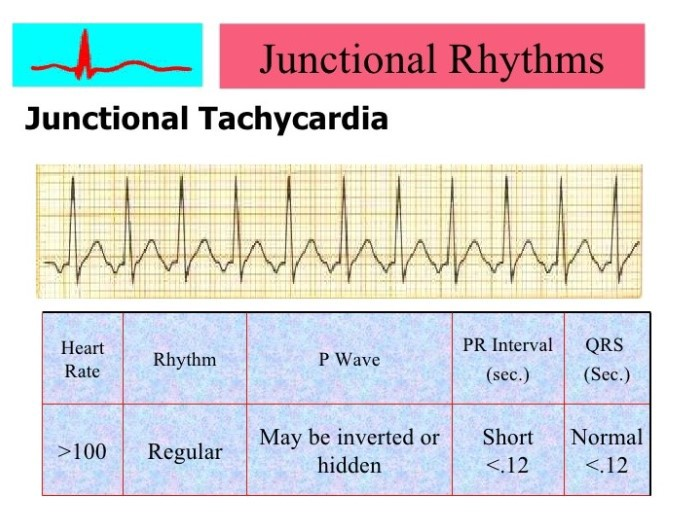
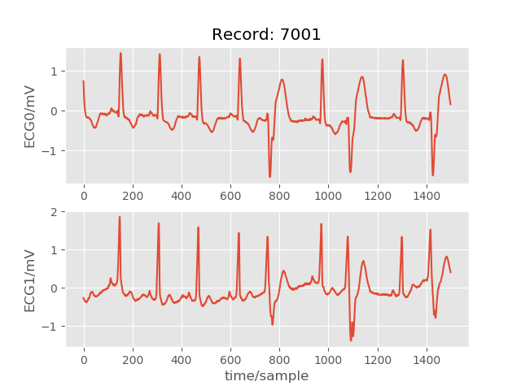
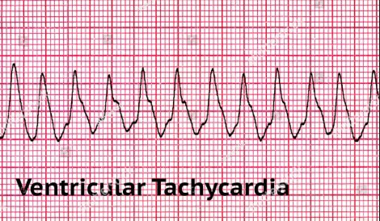
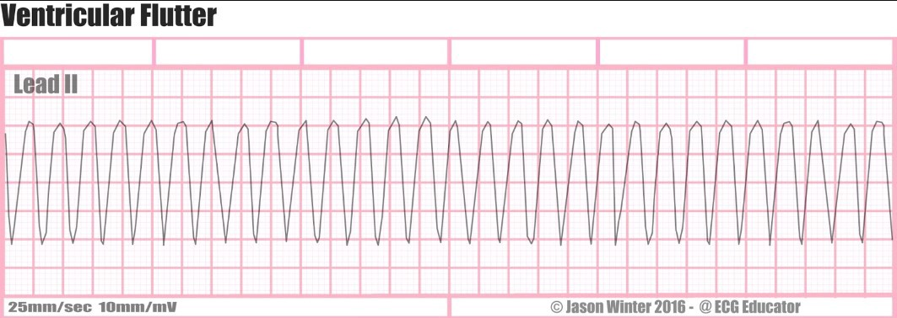

### Do You Have Free Style? (ECG)

因為平常看論文時，會有許多的ECG症狀，而因為短時間不容易記起來，那就做個筆記吧，在本篇文章中會將論文常用到的幾個症狀寫出，在這當中也有Burt大的筆記，非常謝謝你。
### WARNING

另外以下有錯的話請馬上通知，因為知識傳導的錯誤會影響人的認知，進而對病人的性命有非常嚴重的後果，非常感謝您
### **Sinus Rhythm(竇性節律)**

竇性節律指的是心臟去極化的起始點來自竇房結，這裡會介紹6種節律。
- Normal Sinus Rhythm (NSR)
- Sinus Arrhythmia：完整P-QRS-T波，P-P節律不規則(節奏變換一陣子)，但心跳仍然在60~100次之間，一般不需治療。

- Sinus Bardycardia(竇性心搏過緩)：<60次/分去極化，其餘波型正常。

- Sinus Tachycardia(竇性心搏過速)：>100次/分去極化，其餘波型正常，

- Sinus Block(竇性阻斷)：竇房結有時不發生去極化衝動，或太弱，原因為竇房結發生缺血現象，一般不需治療，除非過於頻繁或阻斷時間過長(大於2秒以上)，停滯為RR的兩倍(或倍數)。

- Sinus Arrest(竇性心律暫停)：竇房結受抑，延緩發出去極化之衝動，停滯與RR倍數不同。

### **Atrail Rhythm(心房性節律)**

心房性節律是指心肌去極化之起使來自於心房，但不一定來自於竇房結，這裡介紹5種節律。
- Premature Atrial Contraction(PAC 心房早發性收縮)：
指一個或數個心肌去極化之起始在心房某處，PAC之出現節律不規則外(一個P-QRS-T波)，P波有時比較平有時缺角，診斷方式：相鄰的心率呈現不規則，且有P波，P波提早出現。

- Atrial Tachycardia (AT 心房性心搏過速)：
心肌去極化衝動來自心房， >100次/分去極化，每次衝動均傳至房室結，繼而引起心室去極化。P波形狀異於竇性結律，有時埋於T波中。

- Atrial Flutter ; AF(心房撲動): 心房以250~300次/分產生去極化(心室因為有房室結60~150次/分去極化)；在去極化的過程時，殼能房室結屬於在極化過程之不反應期，因此不見得新房去極化之衝動均會傳至心室，引起心室去極化，因此會看到很多P波才會有一個QRS波，P波鋸齒狀。

- Atrial Fibrillation ; Af(心房纖維顫動): 心房>350次/分產生去極化(心室因為有房室結60~100次/分去極化)。P波難以辨認。

- Wandering Pacemaker(遊走性律點): 引發心肌去極化衝動之結律點不提改變(遊走)，每個P波樣子均不相同。

### **Junctional Rhythm(交界性節律) or Nodal Rhythm(結性節律)**

指自房室連結處發出極化之電衝動，引起整個心臟去極化之節律。

P波不易辨識，可能出現位置有三：
. 高交界性: P波與QRS波距離較短
. 中交界性: P波常埋在QRS波內
. 低交界性: QRS波後產生倒立P波

- Junctional Escape Beat ; JEB(交界型逃脫性收縮(一次)) : 40~60次/分，若交界性節律之QRS波與前一個QRS撥之R-R間隔比原來節律的R-R間隔長時，那就稱為JEB。
- Junctional Escape Rhythm ; JER(交界型逃脫性節律(一系列)) : 40~60次/分

- Premature Junctional Rhythm(早發性交界性節律) : 嚴重時需才治療，不規則

- Accelerated Junctional Rhythm(加速型交界性節律) : 60~100次/分，規則，不需治療

- Paraxysmal Junctional Tachycardia; PJT([陣發性]交界性心搏過速) : 100~240次/分，規則

※ 若交界性節律QRS波與前一個QRS波的RR間隔較短，為PJR；若較長，則為JEB

※ Premature Junctional Rhythm(早發性交界性節律)與PAC有相同特性，但無P波測得

※ Sinus Tachycardia + PAT + PJT = Paraxysmal Supraventricular Tachycardia; PSVT(陣發性心室上心搏過速)

※ Junctional Rhythm通常定義為一類
### **Ventricular Rhythm(心室性節律)**

心室性節律指的是引取心室去極化的電衝動源自於心室，而非竇房結、房室結或心房上的任何一點， 寬大QRS波，T波與QRS波方向相反，P波難判斷。
- Idioventricular Rhythm ; IVR(心室自身節律):寬且巨大QRS波，節律通常<40
- Accelerated Idoioventricular Rhythm ; AIVR(加速型心室自身節律): 寬且巨大QRS波，40 < 節律 < 100
- Premature Ventricular Contraction ; PVC(早發性心室收縮): n個sinus Rhythm後，一個PVC。

- Ventricular Tachycardia VT(心室性心搏過速)，在心電圖上會發現許多寬大且巨大之QRS波羅列，波數超過每分鐘100次。

- Ventricular Flutter VF(心室撲動)，心電圖上之QRS波一個個以不好辨認，但扔可看出一個個的波連接交疊，150>心搏>300。

- Ventricular Fibrillation Vf(心室纖維顫動)，心電圖上之QRS波不意辨認，已呈現雜亂高高低低之小波連接不斷。

+-----------------------------------------------------------------------------------+

| **[View original post on Medium](https://medium.com/jacky-life/do-you-have-free-style-ecg-48643a2b1bbf) - Converted by [ZhgChgLi](https://blog.zhgchg.li)/[ZMediumToMarkdown](https://github.com/ZhgChgLi/ZMediumToMarkdown)** |

+-----------------------------------------------------------------------------------+
