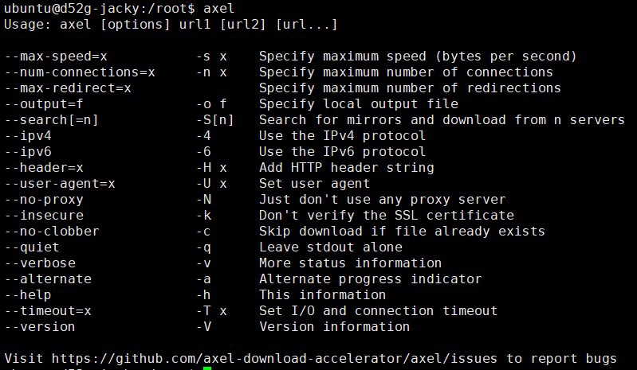

### How to download big file on ubuntu?


If you use ubuntu systems, we usually use wget as a must-have tool for downloading files.

However we know wget is a one process tools.

So if we need download big file. wget will be very slow.

I recommend a tool called axel.
### Install axel
```
sudo apt update
sudo apt install axel
axel --help
```

### Download file

As an example, I downloaded the 831 MB file.

wget need use 4 hr when network speed have 1 Mbit/s.

However when we use axel spent time only 5 minutes.

The command will look like this:
```
axel -n 80 -S5 [http://ftp.1000genomes.ebi.ac.uk/vol1/ftp/technical/reference/human\_g1k\_v37.fasta.gz](http://ftp.1000genomes.ebi.ac.uk/vol1/ftp/technical/reference/human_g1k_v37.fasta.gz)


```
- -n : use 80 thread accelerate download
- -S5 : This means that the file search engine filesearching.com is used to find the image file in order to increase the download speed
- -o : save file path

### Download FTP file

Sometimes we need use ftp download files.

So how to use axel download ftp file ?
```
axel -n 32 -S5 \  
"ftp://gsapubftp-anonymous: [@ftp](http://twitter.com/ftp).broadinstitute.org/bundle/b37/NA12878.HiSeq.WGS.bwa.cleaned.raw.subset.b37.vcf.gz"


```
- ftp:// : you use protocol
- gsapubftp-anonymous : username
- :password : ftp password
- @ : we want to download url

### End

Next time I will talk you how to download GCP file using mutlithread.


+-----------------------------------------------------------------------------------+

| **[View original post on Medium](https://medium.com/jacky-life/how-to-download-big-file-c17688745a5d) - Converted by [ZhgChgLi](https://blog.zhgchg.li)/[ZMediumToMarkdown](https://github.com/ZhgChgLi/ZMediumToMarkdown)** |

+-----------------------------------------------------------------------------------+
