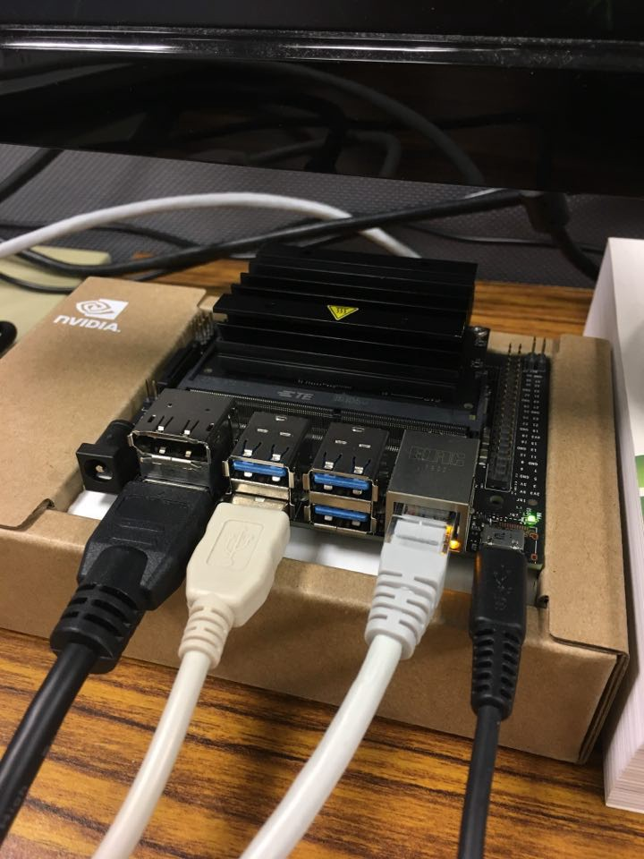
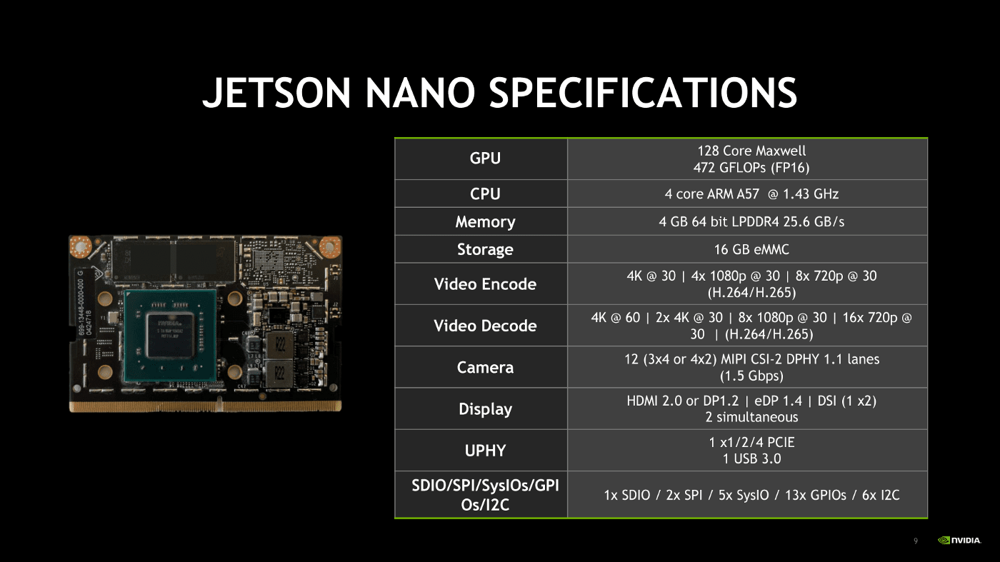
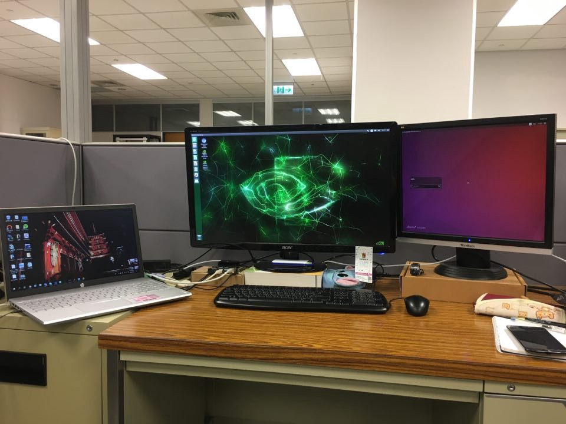
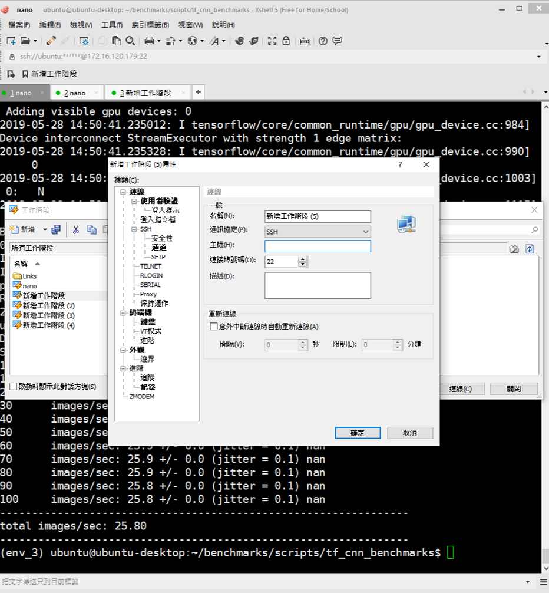
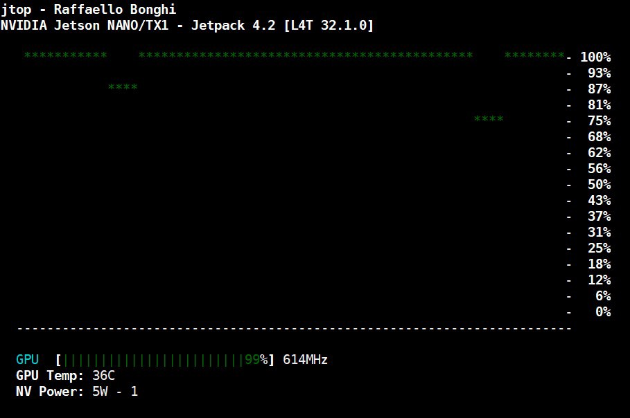
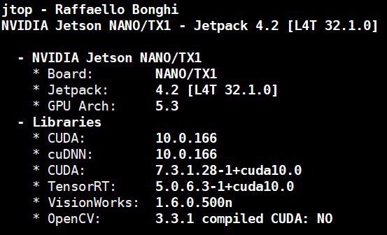
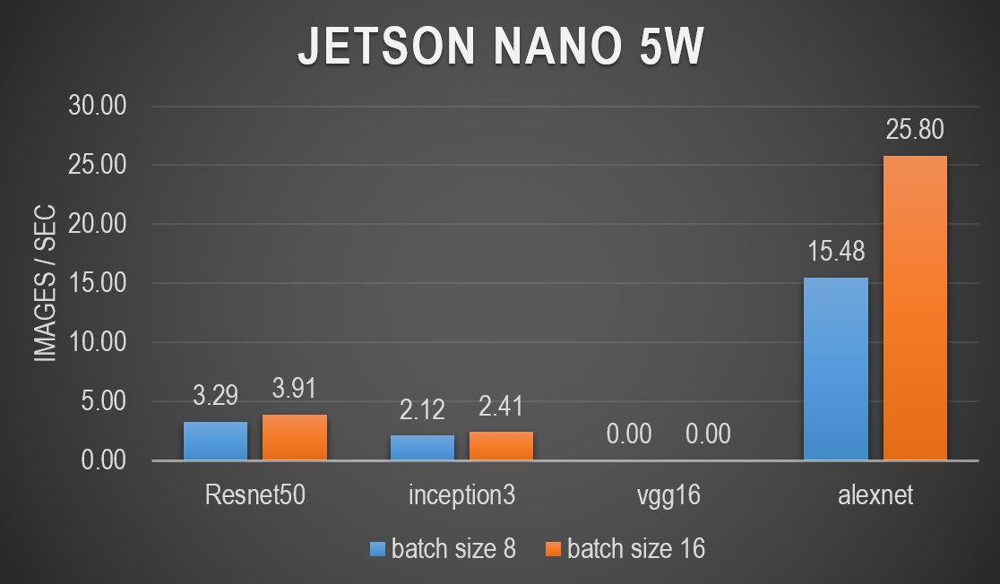
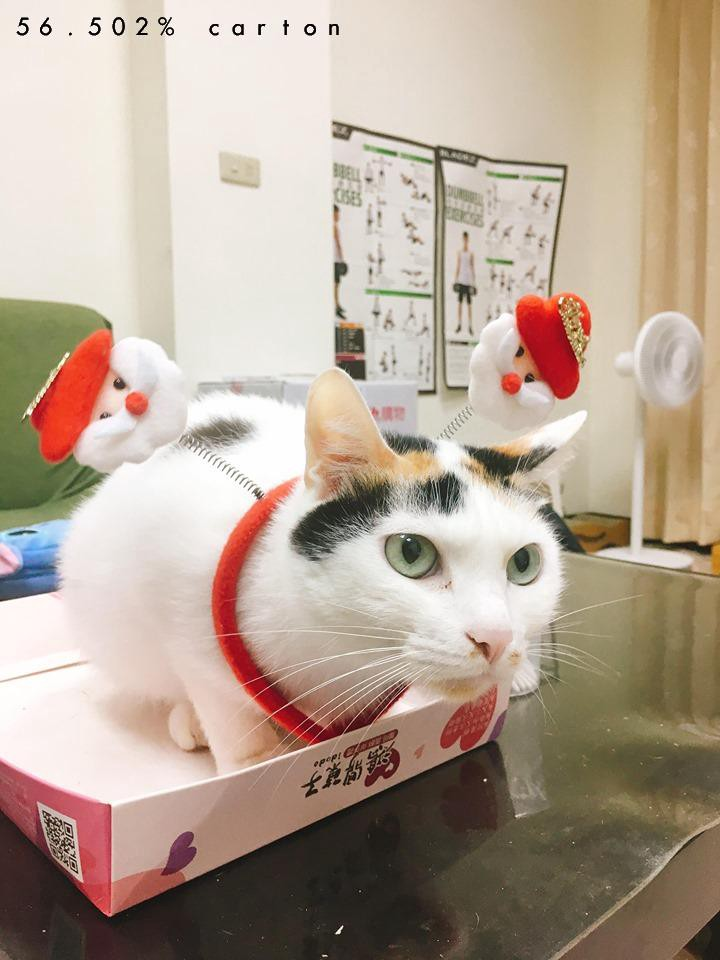
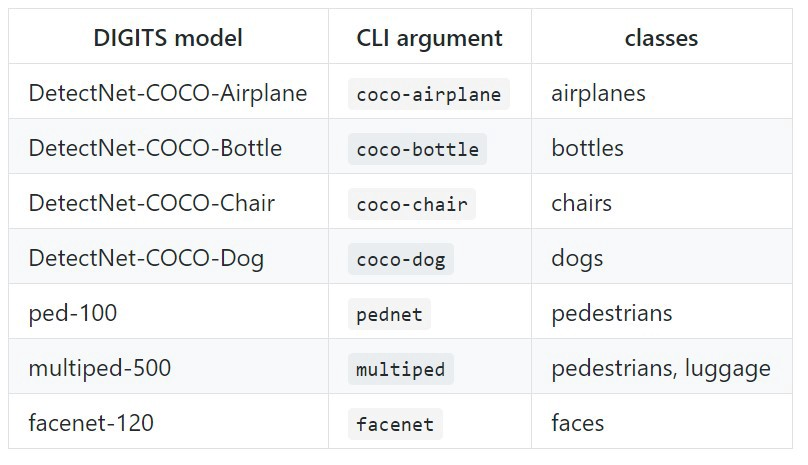

### Jetson Nano


本篇內容跟大家介紹的是 jetson nano 從灌系統到測試效能以及做些 TensorRT 的應用。

首先先讓大家看一下 Nano 長怎麼樣。

各位觀眾 !!!


Sorry… 放成 ipod nano..

讓我們從重看一下真正的 Nvidia Jetson Nano 長怎樣。


剛開始拿起來比想像中的還要重一點，可能是本身玩板子的時間太少所以不夠專業，這塊板子最酷的地方在於支援 4K 高畫質，看石原可以更清楚了 XDD。
### Jetson Nano 規格


這裡值得提的地方在推薦 storage 建議使用 32GB ，因為灌個 OS 就要 12GB；另外電源也推薦 DC jack，如果像我一樣懶得去買的話，那 micro USB 推薦使用 5V (2.5A~5A) 的電源，不然如果跑複雜太高的 model，還沒跑完就會先斷電了...
### 讓 nano 重生
. 透過官方提供的 SD format 將SD Card 裡面的資訊 format 。[**_官方_**](https://developer.nvidia.com/embedded/learn/get-started-jetson-nano-devkit#write) 提供三種 OS 做 format(windows, mac, linux).


2. 下載[官方](https://developer.nvidia.com/embedded/dlc/jetson-nano-dev-kit-sd-card-image)提供的 image 檔 (Ubuntu 18.04 LTS)，下載檔案約 5.3 GB，解壓縮後大概 12 GB。


3. 透過官方提供的燒錄器 [Etcher](https://www.balena.io/etcher)，將 image 檔案燒進去，最後記得燒完以後要退出記憶卡，不然很有可能會發生錯誤。


4. 將 mirco SD 放入 nano 的插槽中，插入電源開機。


5. 裝 HDMI 的時候不建議使用轉接頭，有可能會無法顯示。

6. 經過一些跟 ubuntu 一樣的系統安裝就會像下圖一樣安裝完成。


超帥 !!! 因為接了 HDMI，讓他感覺非常的潮，

### SSH Jetson Nano

使用 ssh 的好處有兩個
. 可以降低在 model 時候 4K 高畫質還不斷的吃著你的 GPU 資源。
. 電流不夠的風險又可以降低了一點。


### htop, nvidia-smi 結合

在 Jetson 中有一個非常好用的工具就是 jtop，可以同時查看 CPU 資源與 GPU 資源，另外也可以看目前 CPU 與 GPU 的溫度與功耗，另外他還有貼心的服務，就是將你目前的 library show 出來。
```
sudo apt-get install python-pip python-dev build-essential 
sudo pip install --upgrade pip
sudo -H pip install jetson-stats
sudo jtop
```



### 安裝必備套件

因 image 本身就有安裝 CUDA 以及 cuDNN 和 openCV 所以讓我們省去了非常多的麻煩，首先我們先安裝 python3 相關套件。
#### Virtualenv
```
sudo apt-get install virtualenv -y
mkdir envs
cd envs
virtualenv -p /usr/bin/python3 env_example
source ~/envs/env_example/bin/activate
```
#### OpenCV 與 Virtualenv 做連結

因為在虛擬環境以外 opencv 已經裝好了，所以我們需要做的目標只要把 virtualenv 跟 opencv 結合就可以了。

首先先知道 opencv 的路徑以及需要裝numpy。
```
pip install numpy
sudo find / -name "cv2*"
```


知道路徑以後將我們說需要的路徑 link 到我們的虛擬環境中。
```
cd ~/envs/env_example/lib/python3.6/site-packages/
ln -s /usr/lib/python3.6/dist-packages/cv2.cpython-36m-aarch64-linux-gnu.so
```

成功拉~

#### 安裝 Tensorflow-GPU

萬事俱備，只欠東風，如果像過去安裝 server 一樣裝 tensorflow-gpu 那在執行上會出現很多問題，因此官方建議使用他們專門給 Jetston 系列裝的 tensorflow-gpu，首先我們要先去官網查看一下目前的版本，我個人裝的是中間的版本不新也不舊，這樣就不用擔心 bug 太多。


下面這個是同一行，拿去 command 按 enter 即可，可能會很久喔~

要有一點耐心 ...
```
pip install --extra-index-url https://developer.download.nvidia.com/compute/redist/jp/v42 tensorflow-gpu==1.13.1+nv19.4
```
### 增加 SWAP

好險有[大神](https://chtseng.wordpress.com/2019/05/01/nvida-jetson-nano-%E5%88%9D%E9%AB%94%E9%A9%97%EF%BC%9A%E5%AE%89%E8%A3%9D%E8%88%87%E6%B8%AC%E8%A9%A6/)提供需要建立 swap，不然每次超過 4G RAM 就當機真的是一件很麻煩的事情，


下述的指令是大神提供，小弟也只是複製貼上。
```
# 這裡設 4G 你也可以設8G 等等
sudo fallocate -l 4G /swapfile
sudo chmod 600 /swapfile
```

```
sudo mkswap /swapfile

sudo swapon /swapfile

sudo swapon -show
```


自從用了 swap 以後，就會比較不容易下 command 的時候就比較不容易 delay 了，另外有使用 model 訓練時，若是那偵測可以吃得下 free swap + free mem 那就不會 break up 出來，不然很容易無法執行。
### 切換高低功率

當訓練的時候，有可能因為你的電力無法負荷而馬上跳電，nvidia 在這裡算是很親民的提供兩種方式讓你轉換，5w, 10w，降成 5w 後許多 model 就跑得動了如: Resnet50，下面是轉換低功率與正常功率的指令。
```
# 知道目前是哪一個 mode
sudo nvpmodel -q
# 將目前的瓦數 降為5瓦
sudo nvpmodel -m1
```

改成 5w 後，會自動的將兩個 cpu 關閉，只使用 cpu 1, 2。

### 測試效能

因為到寫完這篇文章時，我的 micro usb 電源線都還沒到貨，所以 10w 的測試之後再補上，先做 5w 的。

我們拿 tensorflow [官方測試](https://github.com/tensorflow/benchmarks)的 project 來進行驗證，我們共測了 4 種 model，resnet50, inception3, vgg16, alexnet，並且透過不同的 batch size進行測試， batch size 有 8, 16 兩種選擇。



VGG16 為 0 的意思是 他跑到一半就 OOM 了，為了公平起見，這邊也不特別在增加 swap 來嘗試是否可以成功。
### Jetson-inference

Nvidia 的[大大](https://github.com/dusty-nv/ros_deep_learning)提供了一些 model 供大家嘗試，所以我也挑了幾個來玩一下，另外有[大神](https://blog.cavedu.com/2019/04/30/nvidia-jetson-nano-example/)寫了這篇應用的文章可以參考一下，這些 model 有趣的地方在它們都支援了 [TensorRT](http://technews.tw/2017/09/27/nvidia-tensorrt-3/)據說性能可以大幅提升，


安裝步驟，中間過程可能會有一點久，聽個幾首 Bruno mars 的歌，應該就好了。
```
cd ~
sudo apt-get install git cmake
git clone https://github.com/dusty-nv/jetson-inference
cd jetson-inference
git submodule update --init
mkdir build
cd build
cmake ../
make
sudo make install
```

全部的 model 都會放在 ~/jetson-inference/build/aarch64/bin，所以先 cd 過來，所有的 model 在第一次執行時都會比較慢，所以建議可以邊聽周杰倫的音樂 run 起來會比較快。
```
cd ~/jetson-inference/build/aarch64/bin
```
#### ImageNet 的檢測
```
# cat.jpg 是我自己放進去的
./imagenet-console cat.jpg cat_detect.jpg
```

原圖


辨識後的圖片


結果出來囉，該算是對還是不對呢 XDDD
### Detectnet 檢測

因為我們並沒有清楚的說明需要分類什麼因此，這次我們來清楚的定義吧。
```
./detectnet-console subway.jpg subway_detect.jpg facenet
```

這次我們想要將圖片中有人臉的 mark 起來。


酷吧~

其實他有提供許多可以檢測的方式，供大家使用。

### 感謝

謝謝本次的 Sponsors Vic 讓我有機會可以這麼快可以玩到這片轟動武林的 Nano 板，也感謝 Charles 的大力幫忙，最後感謝 [ZhgChgLi](8854784154b8?source=post_page-----9d89cbf2fc18--------------------------------)，是因為你才讓我繼續想要寫這篇的原因。

### 心得

這塊板子感覺是一個里程碑，可以去思考未來 AI 的趨勢以及 AI 真的慢慢走入你我的生活中了。

### 參考文章
- [Deploying Deep Learning](https://github.com/dusty-nv/jetson-inference)
- [Jetson Nano — Use More Power!](https://www.jetsonhacks.com/2019/04/10/jetson-nano-use-more-power/)
- [Jetson Nano Developer Kit (official)](https://developer.nvidia.com/embedded/buy/jetson-nano-devkit)
- [Jetson Nano Developer Kit](http://www.honghutech.com/Jetson-Nano-Developer-Kit)
- [NVIDIA Jetson Nano學習筆記](https://omnixri.blogspot.com/2019/05/nvidia-jetson-nano.html)
- [NVida Jetson Nano 初體驗（一）安裝與測試](https://chtseng.wordpress.com/2019/05/01/nvida-jetson-nano-%E5%88%9D%E9%AB%94%E9%A9%97%EF%BC%9A%E5%AE%89%E8%A3%9D%E8%88%87%E6%B8%AC%E8%A9%A6/)
- [分類模型辨識北極熊與即時影像人臉辨識](https://blog.cavedu.com/2019/04/30/nvidia-jetson-nano-example/)


+-----------------------------------------------------------------------------------+

| **[View original post on Medium](https://medium.com/jacky-life/jetson-nano-9d89cbf2fc18) - Converted by [ZhgChgLi](https://blog.zhgchg.li)/[ZMediumToMarkdown](https://github.com/ZhgChgLi/ZMediumToMarkdown)** |

+-----------------------------------------------------------------------------------+
