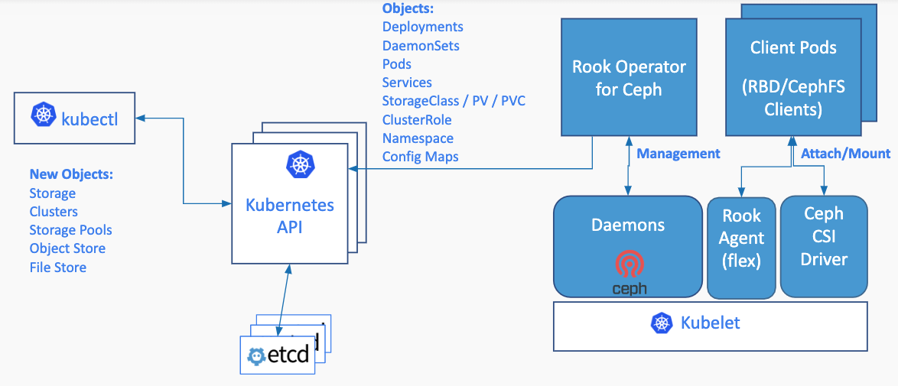
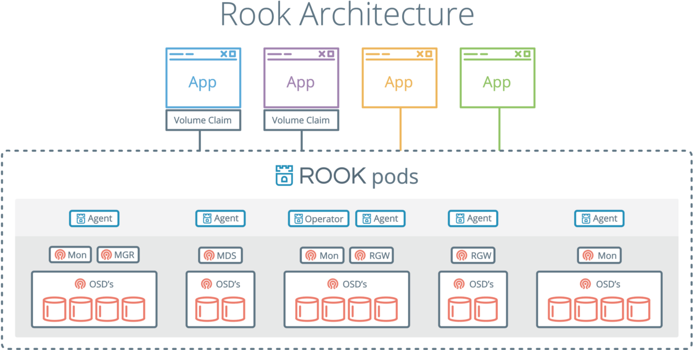
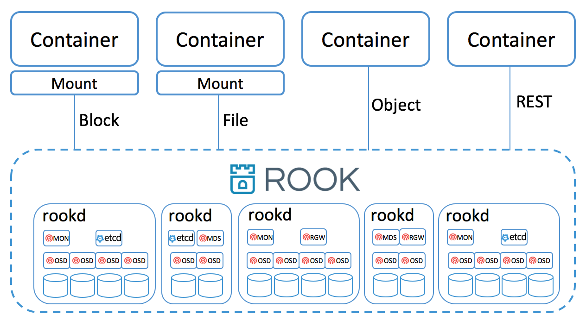
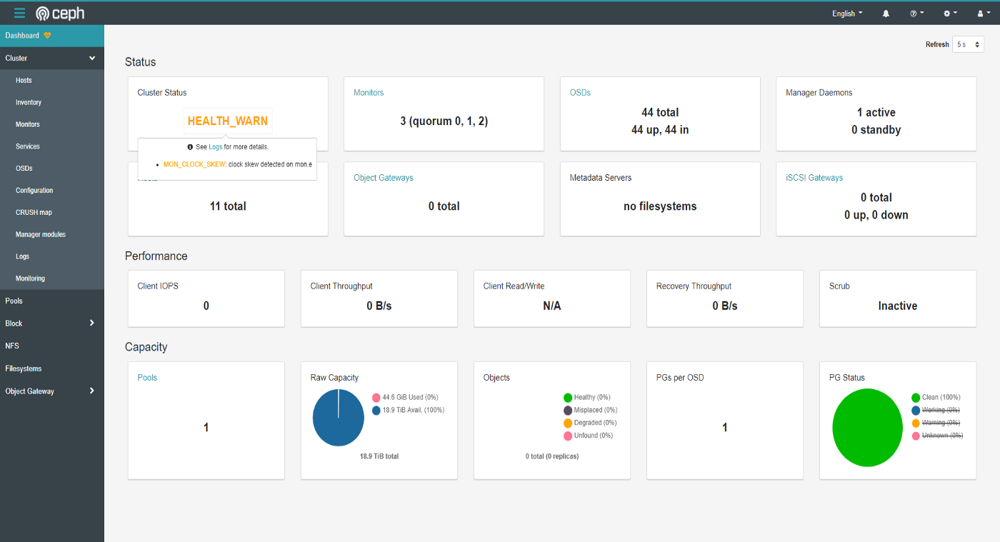

### 在 K8S 使用 Rook 安裝 CEPH


下圖是 K8S, Rook, CEPH 之間的關係。


使用 Rook 安裝完 CEPH 後的示意圖，我們可以使用 PVC 對 CEPH 的 RBD, CephFS, RGW，進行操作，這樣的好處在於本身並未研究 CEPH 的工程師，也可以輕鬆的享受使用 CEPH 所帶來的便利。



 **環境配置:** 
- Kubernetes: 1.19
- Rook: 1.4
- Ceph: 15.2.4


 **不能不注意:** 
- 使用 lvs, vgs, pvs 查看全部機器有無未刪除 LVM。
- 先 pvscan 查看非 OS disk 有無 LVM 紀錄。
- 使用 wipefs -a /dev/sd[b-c] 刪除過去垃圾。

###  **Step 1:下載 Rook** 
```
$ git clone [https://github.com/rook/rook.git](https://github.com/rook/rook.git)  
$ cd rook  
$ <!-- -->git checkout release-1.4  
$ <!-- -->cd cluster/examples/kubernetes/ceph


```
### Step 2: 使用 yaml 安裝 CEPH
```
# 覺得成功時我們來對照一下，會產生的 pods 有哪些  
$ kubectl -n rook-ceph get pods  
# **mgr 1, mon 3,**   
# **rook-ceph-crashcollector (看有幾個 node 就有幾個)**  
# **rook-ceph-osd (查看有幾個 disk ，就會有幾個 pod，他的排序會從 0 開始)**


```
### Step 3: 建立 Toolbox Pod 查看 CEPH 細節
```
$ kubectl create -f toolbox.yaml
$ kubectl -n rook-ceph get pods | grep ceph-tools
rook-ceph-tools-649c4dd574-gw8tx   1/1  Running  0   3m20s
$ kubectl -n rook-ceph exec -it rook-ceph-tools-649c4dd574-gw8tx bash
$ ceph -s
cluster:
    id:     9ca03dd5-05bc-467f-89a8-d3dfce3b9430
    health: HEALTH_OK
 
  services:
    mon: 3 daemons, quorum a,d,e (age 12m)
    mgr: a(active, since 8m)
    osd: 44 osds: 44 up (since 13m), 44 in (since 13m)
 
  data:
    pools:   1 pools, 1 pgs
    objects: 0 objects, 0 B
    usage:   45 GiB used, 19 TiB / 19 TiB avail
    pgs:     1 active+clean
# ceph 集群可以使用的容量
$ ceph df
# ceph osd 與 node 的關係分布
$ ceph osd tree
```
### Step 4: 使用 Dashboard 查看 Ceph 內容

在這邊我們會直接使用外部的 PC 連進 k8s service 當中，來查看 k8s 的內容。
```
$ vim <!-- -->dashboard-external-https.yaml


apiVersion: v1  
kind: Service  
metadata:  
 name: rook-ceph-mgr-dashboard-external-https  
 namespace: rook-ceph  
 labels:  
 app: rook-ceph-mgr  
 rook\_cluster: rook-ceph  
spec:  
 ports:  
 - name: dashboard  
 port: 8443  
 protocol: TCP  
 targetPort: 8443  
 selector:  
 app: rook-ceph-mgr  
 rook\_cluster: rook-ceph  
 sessionAffinity: None  
 type: NodePort


$ kubectl create -f dashboard-external-https.yaml  
$ <!-- -->kubectl -n rook-ceph get service


```

打開 PC 瀏覽器輸入 [https://master\_IP:31955/](https://172.16.96.13:31955/)，這個時候會需要輸入帳號密碼，帳號是 admin，密碼需要輸入下面命令。

```
$ kubectl -n rook-ceph get secret rook-ceph-dashboard-password -o jsonpath="{['data']['password']}" | base64 --decode && echo
```

### One more thing

刪除 CEPH 集群
```
# **這個步驟會很久喔，要有耐心...**  
$ kubectl delete -f common.yaml  
$ kubectl delete -f cluster.yaml


```
###  **參考資料:** 
- [官方 Rook 對 CEPH 的介紹](https://rook.io/docs/rook/v1.4/ceph-storage.html)
- [官方安裝教學](https://rook.io/docs/rook/v1.4/ceph-quickstart.html)
- [官方移除 CEPH 教學](https://rook.io/docs/rook/v1.4/ceph-teardown.html)
- [Kubernetes上使用Rook部署Ceph系统并提供PV服务](http://www.yangguanjun.com/2018/12/22/rook-ceph-practice-part1/)


+-----------------------------------------------------------------------------------+

| **[View original post on Medium](https://medium.com/jacky-life/%E5%9C%A8-k8s-%E4%BD%BF%E7%94%A8-rook-%E5%AE%89%E8%A3%9D-ceph-1999f52a6fb9) - Converted by [ZhgChgLi](https://blog.zhgchg.li)/[ZMediumToMarkdown](https://github.com/ZhgChgLi/ZMediumToMarkdown)** |

+-----------------------------------------------------------------------------------+
