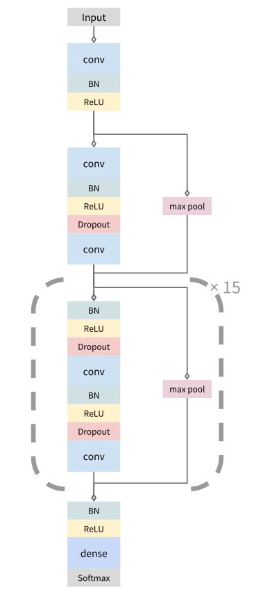
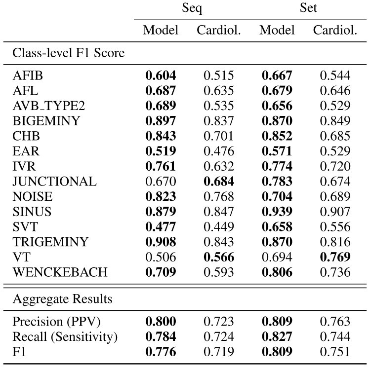
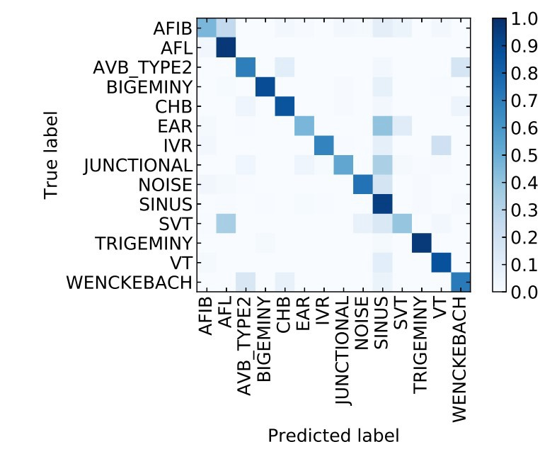
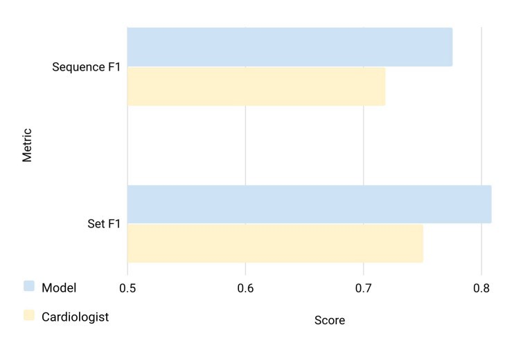

### 論文筆記 — AI當醫生了\!?
### Cardiologist\-Level Arrhythmia Detection with Convolutional Neural Networks

這篇論文主要的內容是吳恩達與史丹佛大學團隊在2017年針對ECG透過深度學習進行檢測。

而寫本篇文章的目的在於，希望能夠將這篇論文的特色，以及為什麼會這麼powerful的地方寫出來，透過這篇文章，讓大家可以快速了解吳恩達大神的神操作，以及若是之後忘記他的key idea 可以回來回憶一下。

另外吳恩達在2019年也寫了一篇paper，我也做了paper的心得在下面連結。
- [論文筆記 — 吳恩達 2019 ECG](%E8%AB%96%E6%96%87%E7%AD%86%E8%A8%98-%E5%90%B3%E6%81%A9%E9%81%94-2019-ecg-a5b03aed9cb8)

那我們開始吧\. \.
### 1\. Dataset

萬事起頭，皆從資料集，好的資料集可以讓你省去非常多的功夫，在這方面我覺得這是這篇paper會成功的原因之一，因為他們的資料量共擁有了30,000個不同的病人的心電圖剪輯，而普通的online open data，如非常有名的MIT\-BIH，也只擁有了47位病人的心電圖，光是在資料的豐富性，這篇paper就展現了一個高度在。

而他們的sensor用的是Zio Patch monitor所收集到的資訊，從這個角度看可以得知，他們的TA不是在於超大儀器的感測準確率，而是在各病房或者未來家中的病患照顧，去做思考。
### 2\. Model

這是這篇論文第二個厲害的地方，他們的想法是基於ResNET的概念去實作，而為什麼要使用ResNET而沒透過其他VGG16相關的model呢？

因為ResNET有個很重要的特性在於，他們將更多資訊帶入更深層的layer中，而這個model不只透過自身的forward傳遞，也可以將前幾層layer的特性一並餵入進後面的layer，讓更deep 的layer可以學習到資訊而不會無法傳遞下去，因此這是這篇論文的一大特色。

下圖是這model圖，總共建立了34層的layer，33層卷積層，一層FCN，以及softmax，使用max pooling的目的在於降低運算量，將image subsampling，做特徵萃取。

### 3\. Training

在這階段共使用了29,163個病人，共64,121個心電圖剪輯作為訓練，有趣的地方在於他們training的時候，以病人作為切割點，1個病人的心電圖剪輯不會同時出現在訓練集以及測試集，這是資料量大的好處，也是他們論文非常細心的地方，因為當我們使用MIT\-BIH資料沒那麼大，那就可能只能以7:2:1的切割法作為切割，最後可能會導致，訓練結果不佳。

Input進去的data為每個30秒 200 HZ的singal，輸出為14個label \(12 heart arrhythmias, sinus rhythm and noise\)
### 4\. Testing

在測試資料集，他們共使用了328個病人，以及336個心電圖剪輯作為測試，而測試集的標籤共有6個心臟病的專家進行標籤；然後再請另外3位心臟病的專家來做benchmark，來跟model做PK，看看是屠龍刀好還是倚天劍強。

在這個地方，這篇paper再次用不同的思維打破了我們的想法，與其用更多不同學習的dataset或者方法比較，還不如直接跟現實生活上的醫生比比看，來的更加實際。
### 5\. Result

在這個地方論文共用了兩種方式進行比較。
- Sequence Level Accuracy：這裡的意思是餵入30s後，每1\.28秒slice或是256 samples就會output一次資訊，來比對是否與true label相符。
- Set Level Accuracy：input 30s後，將輸出結果與ture label比對，而在set level 中不會有時間錯位的懲罰。

從這兩個評比標準，我們可以思考，為什麼他要設這兩個比較方式，大概會有以下幾種原因。

1\. 隨身攜帶的sensor目的就是為了偵測那些不是時常有心律問題的人身上，這個目的在於希望發生事情時，能立即診斷出來。

2\. 當然sequence 一定比較難執行，因此我們才會需要再做一個set當作我們的目標，不但可以看宏觀，也可以找專注，非常好的想法。

我們來看看下圖

很明顯的可以看出，在14種label比較中，model大致上都贏了醫生，可以得知或許我們的model真的慢慢的輔助醫生做更多的判決，讓醫生專注在他們更想做的事情上了。

看另外一張 confusion matrix

可以看出在SINUS中，model很容易跟其他類型的label做混淆，或者是SVT AFL兩者之間也非常的相似，但整體上model 還是表現不錯的水準。

最後看下圖，可以很明顯得知，model的實力已經真的比心臟科的專家來的好許多了，也可以看出Set明顯比sequence 來的更佳的好build，但是從醫生的角度來看sequence竟然也會輸Set這倒是比較意外。

### 6\. 結論

雖然說2017這篇文章距離現在有一段時間了但從他們的做法，已經看到了醫學界的新高度，原因有以下幾個。
1. 我們可以用deep learning去學習ECG的pattern了，雖然還不夠好，但是我們可以降低資源在rule\-based當中。
2. 這篇文章沒有刻意的透過任何取feature的方式，就做到了ECG的判讀，這說明在科技領域中，我們可以大大的降低對ECG完全的認識，因為研究ECG這麼多label的狀況下，還需要有跟心臟病專家一樣的水準，那花的時間是非常久的。
3. 我們可以透過GAN，data generator等方式將資料複雜性不足的補齊，data generator的方式是相對容易多的，因為透過前面的方法得知，資料量是這篇論文的關鍵，所以在醫療ECG中誰擁有更多的data，誰就有機會有更好的model。

### 7\. 思考
1. 從這篇文章中可以得知，醫生標的label，有可能會連帶影響我們model training的結果，那我們該如何解決？

2\. 當類型很像的ECG，我們該如何透過深度學習的方式解決？ \(或許不用softmax\)

3\. 有些label的資料量就是過小，我們只能使用oversampling嗎？

4\. 在論文中使用的皆以200 HZ，改成其他的HZ，是否會影響deep learning的判斷？

5\. 當一個30s的剪輯，裡面有多種label時我們該如何解決。
### 論文參考：

https://www\.nature\.com/articles/s41591\-018\-0268\-3

先寫到這有新的想法在打上…

_Converted [Medium Post](https://medium.com/jacky-life/%E8%AB%96%E6%96%87%E7%AD%86%E8%A8%98-ai%E7%95%B6%E9%86%AB%E7%94%9F%E4%BA%86-d5cf73ef27c8) by [ZMediumToMarkdown](https://github.com/ZhgChgLi/ZMediumToMarkdown)._
