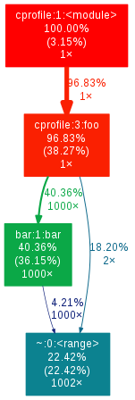

### 我跳進去又跳出來了，打＿


本篇文章介紹的是透過 cprofile 分析 python program ，哪些 function, module 值得優化。

之前有寫一篇關於 numba 提升 python program 速度的文章\( [魯蛇變蟒蛇](https://medium.com/@jackycsie/%E9%AD%AF%E8%9B%87%E8%AE%8A%E8%9F%92%E8%9B%87%E8%A8%98-41e9c047e8e5?source=your_stories_page---------------------------) \)，而這篇使用 time\.time\( \) 來作為評斷程式快慢的依據，但是這種方法不是這麼的專業，因此我們在本篇中透過 cprofile 來簡單的跟大家聊聊，如何透過這個工具可以找出整個 project 中最耗時的部分，這樣可以讓大家透過演算法改進或者 numba 快速優化 module。

其實網路找了一下，發現其實很多人寫過這種文章了 XDD，其實我主要也是給自己筆記用所以還 OK，survey 了一下發現大家最常使用測試程式效率的有 time\.time\( \), timeit\.timeit\( \), cprofile，而 cprofile 是這三種方法中，最清楚，另外 cprofile 在大型專案中用起來是比較方便的因為可以清楚地了解整個流程，以及用綜觀的方式，讓你知道專案的走向以及那些 function call 了幾次，花費的時間等等…，最重要的是可以視覺化。
### 範例程式

首先我們先建立主要的程式，再建立需要 call 外部 function 的 程式。
```python
from extend_function import cal_sum                                                                                                  
  
def foo():
    result = 0
    for i in range(100000):
        result += i
    for i in range(10000):
        cal_sum()
    return result

if __name__ == '__main__':
    foo()
```
```python
def cal_sum():
    result = 0                                                                                                                       
    for i in range(1000):
        result += i
    return result
```

接著執行以下這段， \-s 代表的是再 cumtime 進行 sort。
```
python -m cProfile -s cumtime cprofile.py
```


- ncalls : 代表的是 cprofile 總共 call 了幾次 function，若有像分數的產生代表的是， 前者 2 表示總調用次數，後者 1 表示主要調用次數。
- tottime : 代表的是本身 function 所花費的時間，不包含子函數花費的時間。
- percall : 第一個 percall，等於 tottime / ncalls。
- cumtime : 全部的時間，包含子函數。
- percall : 第二個 percall，等於 cumtime / ncalls。
- filename : lineno\(function\) : 首先是檔案名，括號的是 function name。

### 畢卡索時間

畢竟數字是難以真正了解我們整個 project 的流程，沒圖沒真相我們來看看上述的程式它們畫出圖的結果吧。

在這個地方我們使用 gprof2dot 來畫圖。
```
pip install gprof2dot
sudo apt-get install graphviz
```

首先將剛剛輸出的文字檔轉換成 \* \.pstats
```
python -m cProfile -o cprofile.pstats cprofile.py
```

接著再將剛剛輸出的 cprofile\.pstats 轉換成 \.png 的圖。
```
python -m gprof2dot -f pstats cprofile.pstats | dot -T png -o flow.png
```

結果如下


若是有些 code 比較花的時間比較寫的話 就會是下面的圖。





當然因為上述是簡單的測試，若是一個小專案那會向是下面的圖。


從這張圖可以清楚地得知，那些流程是值得優化的，越靠近紅色，橘色的代表就是整體時間花費非常久的 function。
### 各 function 效能測試

上述說的都是對整個專案或者是整體架構程式做時間評比，那我要如何有像time\.time\( \) 一樣可以分析小程式呢 ?

在這邊共提出兩種做法
- cProfile\.run\( \)
- cProfile\.profile\( \)

#### cProfile\.run\( \)

在這個部分是快速地對某一行 code 進行判斷，去研究這行 code 所花費的時間極其細節。
```python
from extend_function import cal_sum                                                                                                                                                          
import cProfile

def foo():
    result = 0
    for i in range(100000):
        result += i
    for i in range(10000):
        cal_sum()
    return result

if __name__ == '__main__':
    #cProfile.runctx('foo()',globals(),locals())
    cProfile.runctx('foo()')
```


另外也有提供下述的 function可以使用，如果你的分析需要加入其他參數，可以使用這種方式。
- cProfile\.runctx\(command, globals, locals, filename=None\)，filename 是將輸出內容轉成二進位，

#### cProfile 區塊測試

上述的這種方法，主要是針對單行程式做計算，下面的方式則是可以想time\.time\( \) 一樣，針對某一個區塊進行計算。
```python
from extend_function import cal_sum                                                                                                                                                          
import cProfile

def foo():
    result = 0
    for i in range(100000):
        result += i
    for i in range(10000):
        cal_sum()
    return result

if __name__ == '__main__':

    spent_time = cProfile.Profile()
    spent_time.enable()
    foo()
    spent_time.disable()
    spent_time.print_stats()
```
- enable\( \) : 開始分析
- disable\( \) : 結束分析
- print\_stats\( \) : 印出分析結果
- create\_stats\( \) : 停止分析且內部記錄其分析結果
- dump\_stats\(fimename\) : 輸出分析結果於檔案


透過這種簡單的例子可以看到，我們將許多不必要的資訊，都 remove 掉了，讓我們可以透過 cprofile 專住在分析程式的內容中。
### 感謝

本篇文章感謝中正的學弟【 **宇彤】** ，跟我介紹了這個 tool，讓我又多學到了一點點，另外感謝主管 Vic, small 讓我有時間做簡單的 cprofile 研究。


大概寫完簡單的介紹了…\.

剩下的就是有多的需求再去找了
### 參考內容
- [The Python Profilers](https://docs.python.org/2/library/profile.html)
- [\[Python\] cProfile 教學](https://zwindr.blogspot.com/2016/08/python-cprofile.html)
- [Python实践58\-性能调优之cProfile](https://zhuanlan.zhihu.com/p/34847486)
- [Python优化第一步: 性能分析实践](https://zhuanlan.zhihu.com/p/24495603)


_Converted [Medium Post](https://medium.com/jacky-life/%E6%88%91%E8%B7%B3%E9%80%B2%E5%8E%BB%E5%8F%88%E8%B7%B3%E5%87%BA%E4%BE%86%E4%BA%86-%E6%89%93-26cb3038ca0e) by [ZMediumToMarkdown](https://github.com/ZhgChgLi/ZMediumToMarkdown)._
