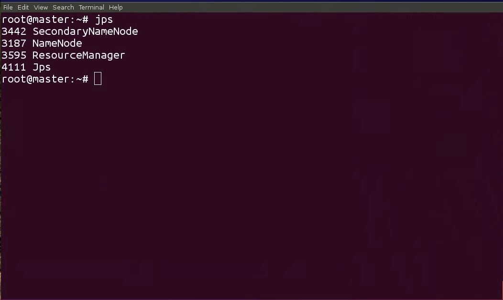
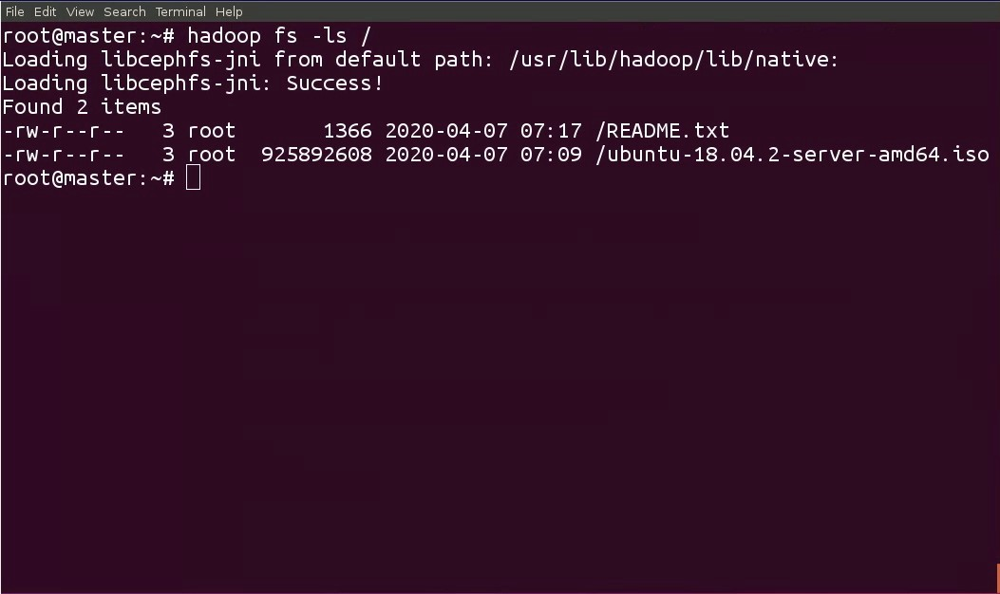

### 使用 CephFS 代替 HDFS


本文將介紹，如何透過 CephFS，替換掉 hadoop 生態系的 HDFS，那為什麼要替換呢？下面將會列出為什麼我會使用 CephFS 代替 HDFS 的原因。
1. Ceph 在硬體的擴建來的更加彈性以及更有架構化。
2. 可以直接對 CephFS 內容進行修改。
3. CephFS 不存在單點控制的訪問入口，全部的 user 皆可以透過各 mon 去訪問 file system。
4. 當儲存空間有限無法切割出各部門所需要的環境。
5. Ceph 提供完整的 POSIX API。
6. Ceph 可以切割冷熱數據與設備，如 SSD pool, HDD pool。
7. 若是想要公司環境想要有雲服務與 hadoop 生態鏈的計算儲存服務，那 CephFS 會來的比 HDFS 更彈性，以及更容易控管硬體設備。


### 1.必備條件

替換 HDFS 成 CephFS 時必須先有幾個必要條件。

已經安裝完下面兩個環境。
- CephFS cluster
- Hadoop cluster


CephFS status


Hadoop cluster




#### Ceph and Hadoop version
- Ceph 13.2.8
- Hadoop 2.10.0
- CephFS 的 Hadoop 套件版本
cephfs-hadoop-0.80.6.jar
- Java 1.8
- python 2

#### Ceph and Hadoop deploy article
- Ceph Deploy ( [webiste](%E4%BD%BF%E7%94%A8-ceph-deploy-%E9%83%A8%E7%BD%B2-ceph-%E5%8F%A2%E9%9B%86-1a780e62cd26) )
- CephFS Deploy ( [website](https://k2r2bai.com/2015/11/21/ceph/cephfs/) )
- Hadoop Deploy ( [website](http://pythonsparkhadoop.blogspot.com/2016/07/5-hadoop-26-multi-node-cluster.html) )

### 2.安裝必要插件

**前提概要** ，以下的示範我們拿的是 hadoop cluster 的 master node 作為示範，若是想要全部的 node 都有此功能，每個 node 跟著 2. 3. 步驟做即可。
- 在 hadoop master 安裝 CephFS dependes packages.

```
root@master:~# wget -q -O- 'https://ceph.com/git/?p=ceph.git;a=blob_plain;f=keys/release.asc' | sudo apt-key add -
root@master:~# echo deb https://download.ceph.com/debian-luminous/ $(lsb_release -sc) main | sudo tee /etc/apt/sources.list.d/ceph.list
root@master:~# apt update
root@master:~# apt-get install libcephfs-jni libcephfs-java
root@master:~# cd $HADOOP_HOME/lib/native/
root@master:~# ln -s /usr/lib/jni/libcephfs_jni.so .
```
- Deploy CephFS hadoop plug-in

```
root@master:~# git clone https://github.com/ceph/cephfs-hadoop.git
root@master:~# cd cephfs-hadoop
root@master:~# apt install maven
root@master:~# mvn -Dmaven.test.skip=true package
root@master:~# cp /root/cephfs-hadoop/target/cephfs-hadoop-0.80.6.jar /usr/lib/hadoop/lib
root@master:~# cp /usr/share/java/libcephfs.jar /usr/lib/hadoop/lib
root@master:~# vim /usr/lib/hadoop/etc/hadoop/hadoop-env.sh

# 放剛剛下載的 package 到 hadoop-env.sh
export HADOOP_CLASSPATH="/usr/lib/hadoop/lib/cephfs-hadoop-0.80.6.jar"
export HADOOP_CLASSPATH="/usr/lib/hadoop/lib/libcephfs.jar:$HADOOP_CLASSPATH"
```
- 在 Ceph 中建立 Hadoop 所需要用的 pool

```
root@ceph-node0:~# ceph osd pool create hadoop1 100
root@ceph-node0:~# ceph osd pool set hadoop1 size 1
root@ceph-node0:~# ceph fs add_data_pool cephfs hadoop1
```
- 透過 ceph-deploy 讓 hadoop master 有 admin 權限

```
# master 安裝 python
root@master:~# /usr/lib/hadoop/lib# apt install python-pip

# 透過 ceph-deploy 使 master 安裝 ceph
root@ceph-node0:~# ceph-deploy install master
root@ceph-node0:~# ceph-deploy config push master
root@ceph-node0:~# ceph-deploy admin master

# 更改 master /etc/ceph/ 權限
root@master:~# chown -R root:root /etc/ceph/
```
- 修改 hadoop core-site.xml 將內部設置為連結 ceph 的 config

```xml
root@master:~# vim /usr/lib/hadoop/etc/hadoop/core-site.xml

<?xml version="1.0" encoding="UTF-8"?>
<?xml-stylesheet type="text/xsl" href="configuration.xsl"?>

<!-- Put site-specific property overrides in this file. -->

<configuration>
<property>
    <name>hadoop.tmp.dir</name>
    <value>/app/hadoop/tmp</value>
</property>
<property>
    <name>fs.default.name</name>
    <value>ceph://10.1.3.175/</value>
</property>
<property>
    <name>ceph.conf.file</name>
    <value>/etc/ceph/ceph.conf</value>
</property>
<property>
    <name>ceph.auth.id</name>
    <value>admin</value>
</property>
<property>
    <name>ceph.auth.keyring</name>
    <value>/etc/ceph/ceph.client.admin.keyring</value>
</property>
<property>
    <name>ceph.data.pools</name>
    <value>hadoop1</value>
</property>
<property>
    <name>fs.ceph.impl</name>
    <value>org.apache.hadoop.fs.ceph.CephFileSystem</value>
</property>
</configuration>
```
### 完成 !
- 看一下 file system 內部資訊

```
root@master:~# hadoop fs -ls /
```




### 3. 將檔案放進 CephFS
```
root@master:~# hadoop fs -copyFromLocal hadoop-2.10.0.tar.gz /
```


### 4. 可能會失敗的原因
- 因為 deploy CephFS plug-in 時我們的路徑是在 /usr/lib/hadooop, 但若是你的 hadoop 路徑在 /usr/local/hadoop，建議換位置即可成功。

### 5. 如何修改 CephFS 資料
- 若是您想要在 master 中修改資料，直接拿到 key ， mount 到任意 folder ，即可修改資料，若是其他 server 想要拿到資料，就必須拿到 key 與建立 client.user 才可以。

```
root@master:~# mount -t ceph ceph-node0:6789:/ /mnt/cephfs -o name=cephfs,secret=AQBAsYJeEC5fHxAAATzV0cLBQgmihe96HZY8CA==
```
### 參考文獻
- [https://docs.ceph.com/docs/mimic/cephfs/hadoop/](https://docs.ceph.com/docs/mimic/cephfs/hadoop/)
- [https://discourse.juju.is/t/integrating-hadoop-with-cephfs/571/2](https://discourse.juju.is/t/integrating-hadoop-with-cephfs/571/2)
- [http://www.kai-zhang.com/cloud-computing/Running-Hadoop-on-CEPH/](http://www.kai-zhang.com/cloud-computing/Running-Hadoop-on-CEPH/)

### 心得

本身難度不高，但沒人寫文章，可能太簡單，大家都照官網做就成功了吧。


+-----------------------------------------------------------------------------------+

| **[View original post on Medium](https://medium.com/jacky-life/%E4%BD%BF%E7%94%A8-cephfs-%E4%BB%A3%E6%9B%BF-hdfs-5416e0765d5f) - Converted by [ZhgChgLi](https://zhgchg.li)/[ZMediumToMarkdown](https://github.com/ZhgChgLi/ZMediumToMarkdown)** |

+-----------------------------------------------------------------------------------+
