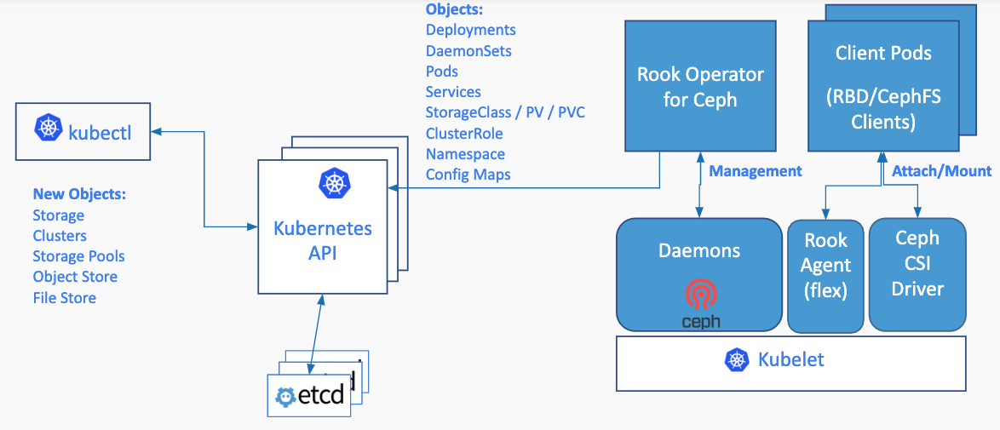
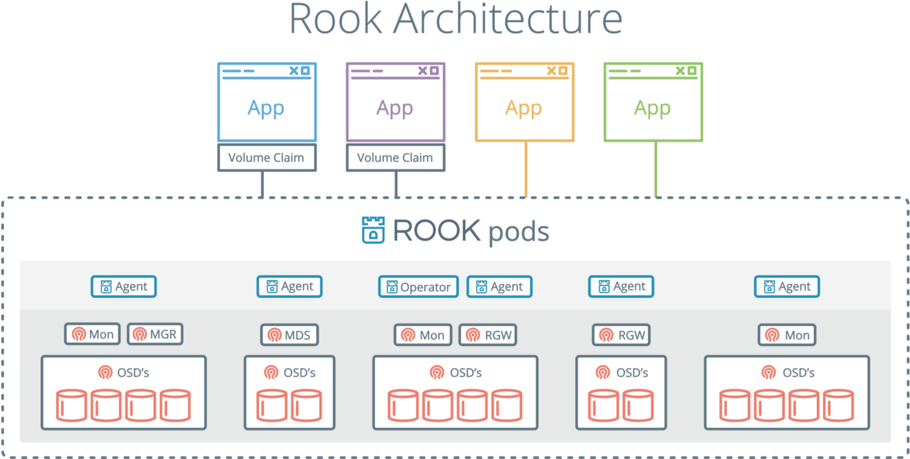
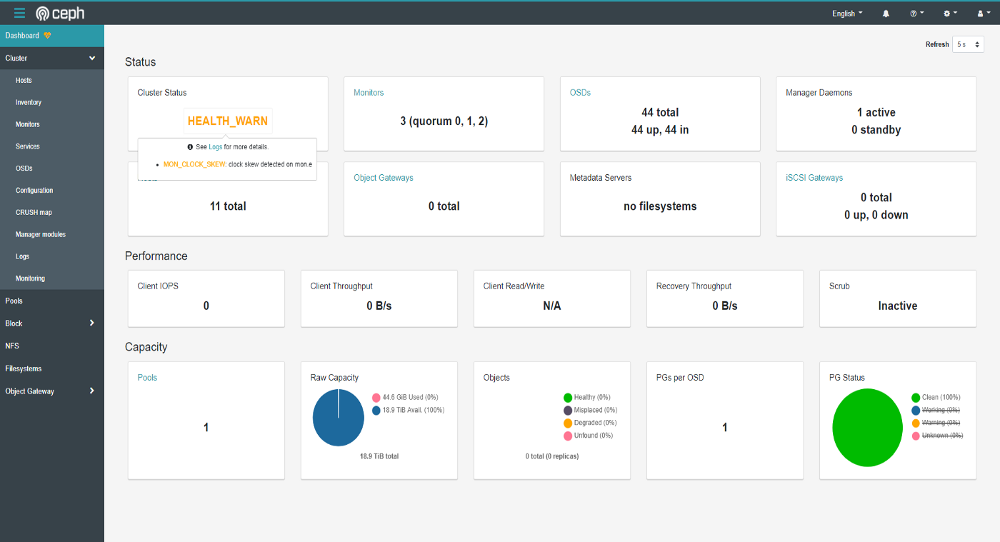

### 在 K8S 使用 Rook 安裝 CEPH


下圖是 K8S, Rook, CEPH 之間的關係。





使用 Rook 安裝完 CEPH 後的示意圖，我們可以使用 PVC 對 CEPH 的 RBD, CephFS, RGW，進行操作，這樣的好處在於本身並未研究 CEPH 的工程師，也可以輕鬆的享受使用 CEPH 所帶來的便利。





**環境配置:**
- Kubernetes: 1\.19
- Rook: 1\.4
- Ceph: 15\.2\.4


**不能不注意:**
- 使用 lvs, vgs, pvs 查看全部機器有無未刪除 LVM。
- 先 pvscan 查看非 OS disk 有無 LVM 紀錄。
- 使用 wipefs \-a /dev/sd\[b\-c\] 刪除過去垃圾。

### **Step 1:下載 Rook**
```
$ git clone https://github.com/rook/rook.git
$ cd rook
$ git checkout release-1.4
$ cd cluster/examples/kubernetes/ceph
```
### Step 2: 使用 yaml 安裝 CEPH
```
$ kubectl create -f common.yaml
# 檢查 namesapce 是否有 rook-ceph 了
$ kubectl get namespace
$ kubectl create -f operator.yaml
# 上述的步驟必須確定 pods 已經處於 running or complete 才能做下一個階段，否則很有可能會 fail，上述的步驟可以需要等一下子。
$ kubectl create -f cluster.yaml
# 在 cluster.yaml 中，需要注意的是
# 你的 pysical machine IP 必須不能使用 192.168.x.x
# 因為這是 kubernetes LAN 使用的 IP，這樣 k8s 會 confuse，導致失敗。
# 需要非常久的時間，請耐心等待.....
```
### Step 3: 建立 Toolbox Pod 查看 CEPH 細節
```
$ kubectl create -f toolbox.yaml
$ kubectl -n rook-ceph get pods | grep ceph-tools
rook-ceph-tools-649c4dd574-gw8tx   1/1  Running  0   3m20s
$ kubectl -n rook-ceph exec -it rook-ceph-tools-649c4dd574-gw8tx bash
$ ceph -s
cluster:
    id:     9ca03dd5-05bc-467f-89a8-d3dfce3b9430
    health: HEALTH_OK
 
  services:
    mon: 3 daemons, quorum a,d,e (age 12m)
    mgr: a(active, since 8m)
    osd: 44 osds: 44 up (since 13m), 44 in (since 13m)
 
  data:
    pools:   1 pools, 1 pgs
    objects: 0 objects, 0 B
    usage:   45 GiB used, 19 TiB / 19 TiB avail
    pgs:     1 active+clean
# ceph 集群可以使用的容量
$ ceph df
# ceph osd 與 node 的關係分布
$ ceph osd tree
```
### Step 4: 使用 Dashboard 查看 Ceph 內容

在這邊我們會直接使用外部的 PC 連進 k8s service 當中，來查看 k8s 的內容。
```
$ vim dashboard-external-https.yaml
apiVersion: v1
kind: Service
metadata:
  name: rook-ceph-mgr-dashboard-external-https
  namespace: rook-ceph
  labels:
    app: rook-ceph-mgr
    rook_cluster: rook-ceph
spec:
  ports:
  - name: dashboard
    port: 8443
    protocol: TCP
    targetPort: 8443
  selector:
    app: rook-ceph-mgr
    rook_cluster: rook-ceph
  sessionAffinity: None
  type: NodePort
$ kubectl create -f dashboard-external-https.yaml
$ kubectl -n rook-ceph get service
```

打開 PC 瀏覽器輸入 [https://master\_IP:31955/](https://172.16.96.13:31955/) ，這個時候會需要輸入帳號密碼，帳號是 admin，密碼需要輸入下面命令。
```
$ kubectl -n rook-ceph get secret rook-ceph-dashboard-password -o jsonpath="{['data']['password']}" | base64 --decode && echo
```




### One more thing

刪除 CEPH 集群
```
$ cd /rook/cluster/examples/kubernetes/ceph
$ kubectl -n rook-ceph delete cephcluster rook-ceph
$ kubectl -n rook-ceph get cephcluster
# 確認 rook-ceph 被刪除
$ kubectl delete -f operator.yaml
```
### **參考資料:**
- [官方 Rook 對 CEPH 的介紹](https://rook.io/docs/rook/v1.4/ceph-storage.html)
- [官方安裝教學](https://rook.io/docs/rook/v1.4/ceph-quickstart.html)
- [官方移除 CEPH 教學](https://rook.io/docs/rook/v1.4/ceph-teardown.html)
- [Kubernetes上使用Rook部署Ceph系统并提供PV服务](http://www.yangguanjun.com/2018/12/22/rook-ceph-practice-part1/)


_Converted [Medium Post](https://medium.com/jacky-life/%E5%9C%A8-k8s-%E4%BD%BF%E7%94%A8-rook-%E5%AE%89%E8%A3%9D-ceph-1999f52a6fb9) by [ZMediumToMarkdown](https://github.com/ZhgChgLi/ZMediumToMarkdown)._
