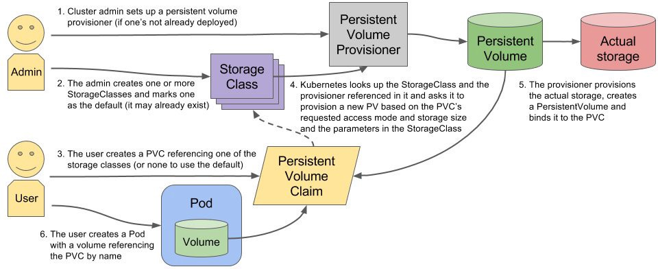
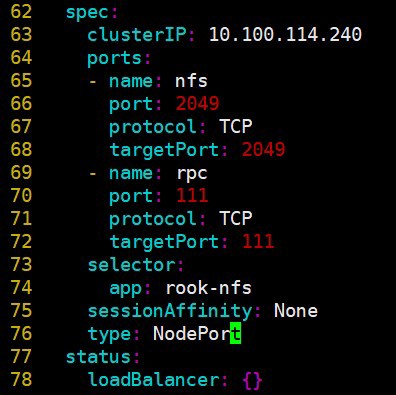

### 透過 K8S 建立 NFS 服務


本文將介紹，透過 kubernetes 建立 NFS 服務，而 Storage class 我們將會使用 CEPH RBD 做儲存空間。

下圖是建立在 kubernetes 建立一個 NFS 服務時，所使用的流程圖。




[參考資料](https://godleon.github.io/blog/Kubernetes/k8s-Config-StorageClass-with-NFS/)
### 行前注意
1. 建立好 kubernetes 集群( [建立集群文章](https://medium.com/jacky-life/%E4%BD%BF%E7%94%A8-kubeadm-%E5%AE%89%E8%A3%9D-k8s-abe1631aa600?source=collection_home---2------3-----------------------) )。
2. 在 kubernetes 已擁有 CEPH 服務( [使用 Rook 建立 CEPH 儲存架構](https://medium.com/jacky-life/%E5%9C%A8-k8s-%E4%BD%BF%E7%94%A8-rook-%E5%AE%89%E8%A3%9D-ceph-1999f52a6fb9?source=collection_home---4------0-----------------------) )。

### Outline
- Step 1: 建立 StorageClass
- Step 2: 建立 PVC 與 StorageClass 連接
- Step 3: Deploy NFS Operator
- Step 4: 建立 Pod 與 PVC 連接
- Step 5: 讓外部機器可以連接到 nfs server

### Step 1: 建立 StorageClass

透過 yaml 檔建立 CEPH RBD StorageClass。
```
$ kubectl create -f rook/cluster/examples/kubernetes/ceph/csi/rbd/storageclass.yaml
```


```yaml
apiVersion: ceph.rook.io/v1
kind: CephBlockPool
metadata:
  name: replicapool
  namespace: rook-ceph
spec:
  failureDomain: host
  replicated:
    size: 3
    # Disallow setting pool with replica 1, this could lead to data loss without recovery.
    # Make sure you're *ABSOLUTELY CERTAIN* that is what you want
    requireSafeReplicaSize: true
    # gives a hint (%) to Ceph in terms of expected consumption of the total cluster capacity of a given pool
    # for more info: https://docs.ceph.com/docs/master/rados/operations/placement-groups/#specifying-expected-pool-size
    #targetSizeRatio: .5
---
apiVersion: storage.k8s.io/v1
kind: StorageClass
metadata:
   name: rook-ceph-block
# Change "rook-ceph" provisioner prefix to match the operator namespace if needed
provisioner: rook-ceph.rbd.csi.ceph.com
parameters:
    # clusterID is the namespace where the rook cluster is running
    # If you change this namespace, also change the namespace below where the secret namespaces are defined
    clusterID: rook-ceph

    # If you want to use erasure coded pool with RBD, you need to create
    # two pools. one erasure coded and one replicated.
    # You need to specify the replicated pool here in the `pool` parameter, it is
    # used for the metadata of the images.
    # The erasure coded pool must be set as the `dataPool` parameter below.
    #dataPool: ec-data-pool
    pool: replicapool

    # RBD image format. Defaults to "2".
    imageFormat: "2"

    # RBD image features. Available for imageFormat: "2". CSI RBD currently supports only `layering` feature.
    imageFeatures: layering

    # The secrets contain Ceph admin credentials. These are generated automatically by the operator
    # in the same namespace as the cluster.
    csi.storage.k8s.io/provisioner-secret-name: rook-csi-rbd-provisioner
    csi.storage.k8s.io/provisioner-secret-namespace: rook-ceph
    csi.storage.k8s.io/controller-expand-secret-name: rook-csi-rbd-provisioner
    csi.storage.k8s.io/controller-expand-secret-namespace: rook-ceph
    csi.storage.k8s.io/node-stage-secret-name: rook-csi-rbd-node
    csi.storage.k8s.io/node-stage-secret-namespace: rook-ceph
    # Specify the filesystem type of the volume. If not specified, csi-provisioner
    # will set default as `ext4`. Note that `xfs` is not recommended due to potential deadlock
    # in hyperconverged settings where the volume is mounted on the same node as the osds.
    csi.storage.k8s.io/fstype: ext4
# uncomment the following to use rbd-nbd as mounter on supported nodes
# **IMPORTANT**: If you are using rbd-nbd as the mounter, during upgrade you will be hit a ceph-csi
# issue that causes the mount to be disconnected. You will need to follow special upgrade steps
# to restart your application pods. Therefore, this option is not recommended.
#mounter: rbd-nbd
allowVolumeExpansion: true
reclaimPolicy: Delete
```
### Step 2: 建立 PVC 與 StorageClass 連接
```
$ kubectl create -f ceph-nfs-pvc.yaml
```


```yaml
apiVersion: v1
kind: Namespace
metadata:
  name:  rook-nfs
---
apiVersion: v1
kind: PersistentVolumeClaim
metadata:
  name: nfs-ceph-claim
  namespace: rook-nfs
spec:
  storageClassName: rook-ceph-block
  accessModes:
    - ReadWriteOnce
  resources:
    requests:
      storage: 700Gi
```
### Step 3: Deploy NFS Operator
```
$ git clone https://github.com/rook/rook.git
$ cd rook/cluster/examples/kubernetes/nfs
$ kubectl create -f common.yaml
$ kubectl create -f provisioner.yaml
$ kubectl create -f operator.yaml
```


### Step 4: 建立 Pod 與 PVC 連接

先加入 ServiceAccount，這部分蠻重要的，因為官網是沒有提到需要加入 Service Account 的，但是若是沒有設定的話，就會沒有權限建立 POD。
```
kubectl apply -f - <<EOF
apiVersion: v1
kind: ServiceAccount
metadata:
  name: rook-nfs-server
  namespace: rook-nfs
EOF
```


```
$ kubectl create -f nfs-ceph-pod.yaml
```
```yaml
apiVersion: nfs.rook.io/v1alpha1
kind: NFSServer
metadata:
  name: rook-nfs
  namespace: rook-nfs
spec:
  replicas: 1
  type: NodePort
  ports:
    - targetPort: 111
  exports:
  - name: nfs-share
    server:
      accessMode: ReadWrite
      squash: "none"
    # A Persistent Volume Claim must be created before creating NFS CRD instance.
    # Create a Ceph cluster for using this example
    # Create a ceph PVC after creating the rook ceph cluster using ceph-pvc.yaml
    persistentVolumeClaim:
      claimName: nfs-ceph-claim
```


### Step 5: 讓外部機器可以連接到 NFS server

當我們 NFS 建立完成後，我們已經擁有對內部的分享資料的功能了，但我們時常需要讓外部不屬於 Cluster 的機器連到 container 做事情，這時候就必須透過 NodePort 開啟 Port ，讓外部的機器可以連進 NFS service 中。
```
$ kubectl -n rook-nfs get svc -o yaml >> rook-nfs-svc-backup.yaml
$ cp rook-nfs-svc-backup.yaml rook-nfs-svc.yaml
$ vim rook-nfs-svc.yaml
```




```
$ kubectl apply -f rook-nfs-svc.yaml
$ kubectl -n rook-nfs get all -o wide
```


外部 Port 就開好了，分別是 30377, 31431。

**換到其他想連接到 nfs 的機器上。**
```
$ apt-get install nfs-common
$ mkdir -p /mnt/nfs/var/nfsshare
$ mount -t nfs -o port=30377 master_node_IP:/ /mnt/nfs/var/nfsshare/
```
### 參考資料
- [https://rook.io/docs/rook/v1.4/ceph-block.html](https://rook.io/docs/rook/v1.4/ceph-block.html)
- [https://rook.io/docs/rook/v1.4/nfs.html](https://rook.io/docs/rook/v1.4/nfs.html)
- [https://ithelp.ithome.com.tw/articles/10195944](https://ithelp.ithome.com.tw/articles/10195944)
- [https://www.opencli.com/linux/debian-ubuntu-install-nfs-server](https://www.opencli.com/linux/debian-ubuntu-install-nfs-server)
- [https://godleon.github.io/blog/Kubernetes/k8s-Config-StorageClass-with-NFS/](https://godleon.github.io/blog/Kubernetes/k8s-Config-StorageClass-with-NFS/)


+-----------------------------------------------------------------------------------+

| **[View original post on Medium](https://medium.com/jacky-life/%E9%80%8F%E9%81%8E-k8s-%E5%BB%BA%E7%AB%8B-nfs-%E6%9C%8D%E5%8B%99-6bbe4aeaf2cf) - Converted by [ZhgChgLi](https://zhgchg.li)/[ZMediumToMarkdown](https://github.com/ZhgChgLi/ZMediumToMarkdown)** |

+-----------------------------------------------------------------------------------+
