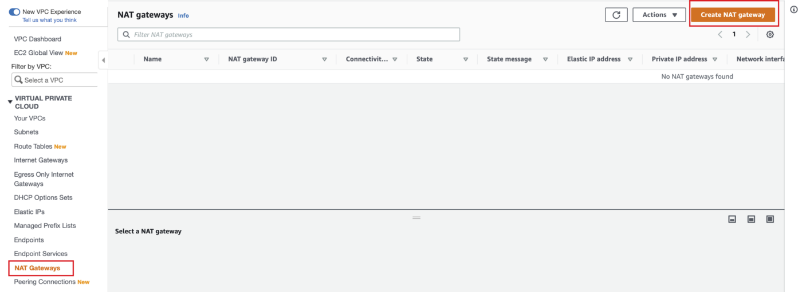
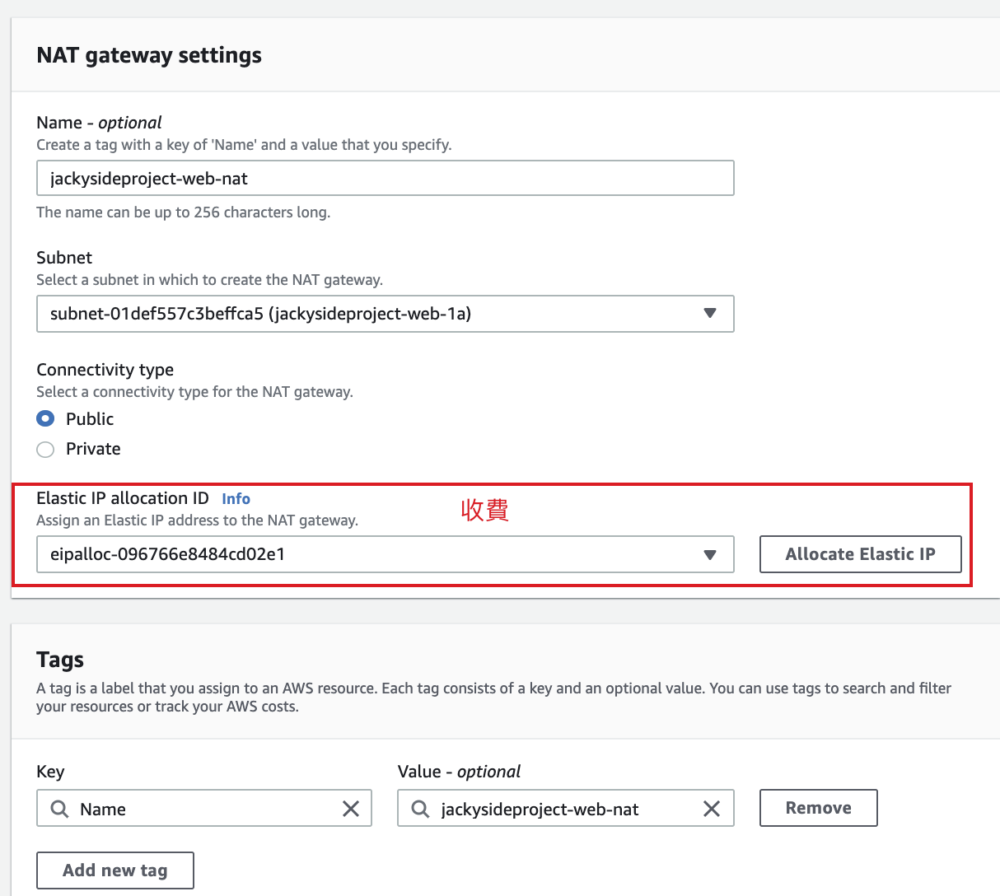
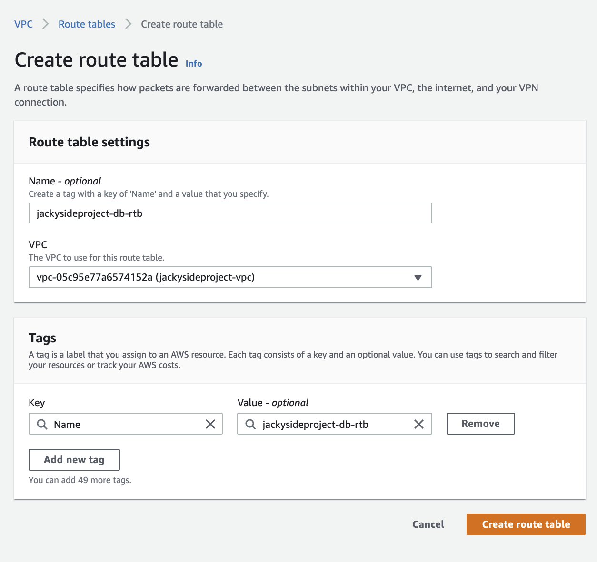
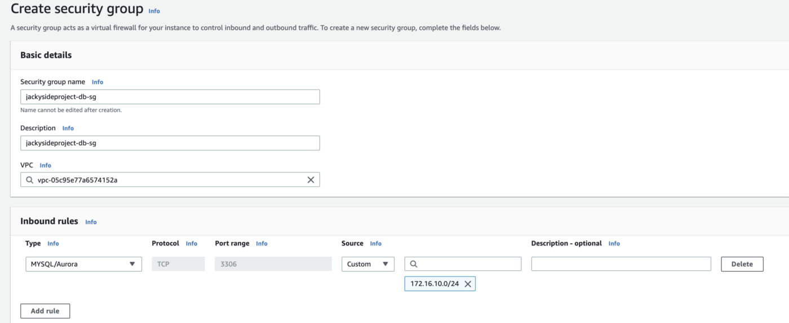
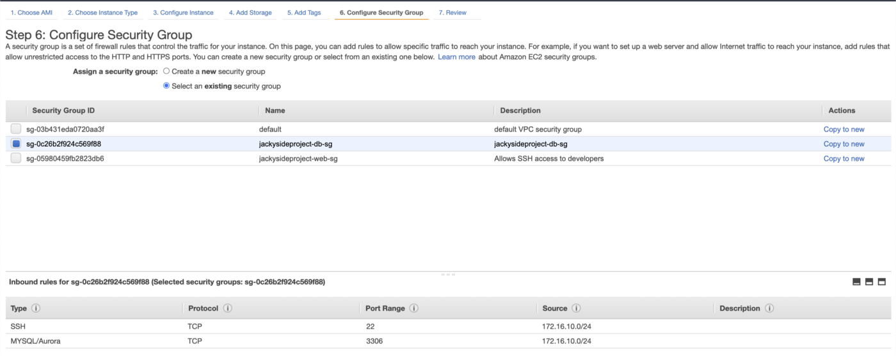
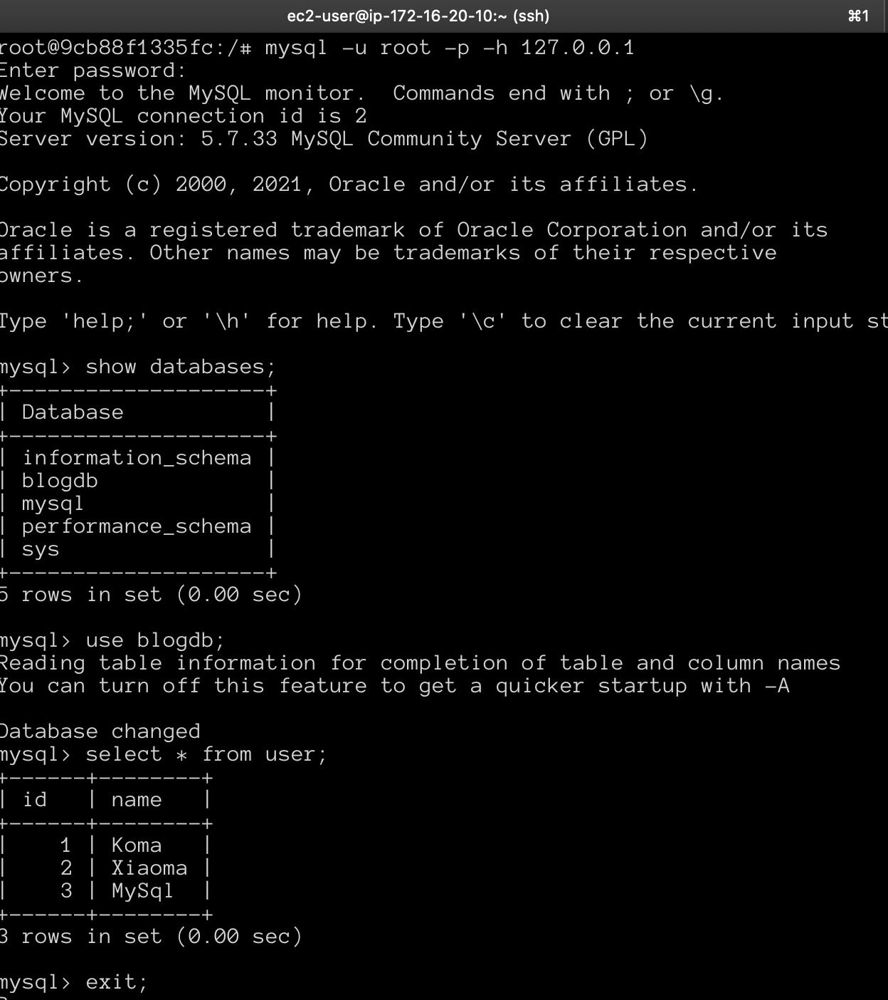
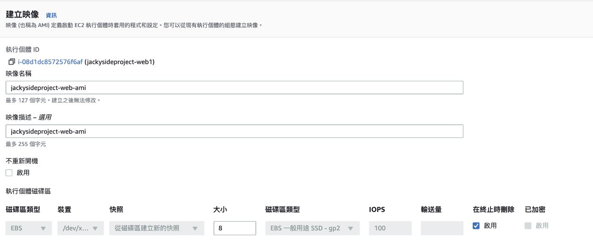

### AWS — 學習筆記\(2\) NAT/Container Service


Hi all,

本篇的筆記主要紀錄的是 Private IP 的 OS 如何透過 NAT 進行對外的網路溝通，另外也會將 Public IP 與 Private IP 的服務進行連接。Public subnet 使用的是 web container ，Private subnet 使用的是 DB container，中間溝通的方法是使用 Port 3306。

最後此篇 container 是從 [小馬 blog](https://github.com/komavideo/LearnAWS) pull 下來的，因為我目前只想專注 AWS 元件的佈建，等之後需要用到 EKS 或者 ECS 在自己做一下 container，但若是目前還不太會 container 技術的可以玩一下 Podman or Docker 。

下圖是本次的架構圖，承接了 [AWS — 學習筆記\(1\)](aws-%E5%AD%B8%E7%BF%92%E7%AD%86%E8%A8%98-1-deploy-env-ec2-ea5e5f56d936) 的內容繼續實作。


接著是建置步驟:
1. 建立 AWS NAT
2. 建立屬於 Private subnet 的 Routing table
3. 建立 AWS Private subnet 的 Security group
4. 建立 Private subnet 的 EC2 instance\.
5. 在 Private subnet 中 pull 小馬的 DB container
6. 在 Public subnet 中 pull 小馬的 Web container，將 Public subnet 的 OS 與 Private subnet 進行溝通。


Naming rule：
- NAT : jackysideproject\-web\-nat
- DB Routing Table: jackysideproject\-db\-rtb
- DB Securty Group: jackysideproject\-db\-sg
- EC2 Private IP: 172\.16\.20\.10/32
- Private subnet OS: jackysideproject\-db1

### 1\. 建立 AWS NAT

參考文章： [AWS NAT 有什麼不同？](https://docs.aws.amazon.com/zh_tw/vpc/latest/userguide/vpc-nat-gateway.html)

注意：建立 NAT 是需要收費的喔，它沒有免費的額度可以使用。

我們 create NAT gateway





接著我們選擇此 NAT 元件在 Public subnet 當中，並且 launch 一個 Elastic IP 來使用。




### 2\. 建立屬於 Private subnet 的 Routing table

首先我們會先建立一個 routing table，並設定成此 VPC 都可以使用。





接著建立好路由表以後，我們將所有非 172\.16\.0\.0/16 的網路倒給 NAT 去做轉送，讓網路透過 NAT 對外溝通，這樣 private EC2 才可以做通訊。


將這個 routing table 設定給 private subnet 做使用。


### 3\. 建立 AWS Private subnet 的 Security group

此步驟我們建立 Prviate subnet 的 Securty group，將 Port 22/3306 allow 進 private subnet 中。





Allow SSH, 否則沒有人可以連得進去 Private subnet 的 OS\. 哈哈


### 4\. 建立 Private subnet 的 EC2 instance\.

選擇 private subnet，並且將 auto\-assiang public IP disable 掉。


設定這個 EC2 的 IP 為 172\.16\.20\.10


選擇此 EC2 使用哪一個 Security group，在這裡我們使用 DB 的那個，允許 22 port 以及 3306 port 進來。





Cool~


### 5\. Private subnet 中 pull 小馬的 DB container

在 pull container 前我們必須 pre\-check
1. Public IP 連的進 private IP 的 OS 嗎？
2. 可以確認可以透過 NAT gateway 對外溝通嗎？

```
# Use public OS ssh to private OS
ssh -i aws_ssh_key.pem ec2-user@172.16.20.10

# Check NAT gateway
sudo yum update -y
ping 8.8.8.8
```

確認有網路後， 從網路上 pull 一個 container 使用，在這裡我是參考小馬 github 的 container 直接使用，有興趣的也可以自己建立一個。
```
# pull mysql container 
$ docker pull komavideo/deeplearnaws-mysql:latest

# running container and allow 3306 port
$ docker run --name deeplearnaws-mysql -e MYSQL_ROOT_PASSWORD=12345678 -p 3306:3306 -d --restart=always komavideo/deeplearnaws-mysql:latest

# check mysql container is running.
$ docker ps

# access to mysql container
$ docker exec -it deeplearnaws-mysql bash -p

# 按照下面指令，就可以看到 db 的資料
>mysql -u root -p -h 127.0.0.1
mysql> show databases;
mysql> use blogdb;
mysql> select * from user;
mysql> exit;
```





成功


### 6\. Pull web container 以及與 Private subnet 的 DB 溝通。
```
# Switch 到 Public IP 的 OS 中
# Pull web container
$ docker pull komavideo/deeplearnaws-web:latest

# Running web container，allow port 30 到 container 裡面的 3000
$ docker run --name deeplearnaws-web -p 80:3000 -d --restart=always komavideo/deeplearnaws-web:latest

# Check container status
$ docker container ls -a
$ docker logs -f deeplearnaws-web
$ docker ps
```

接著在自己的 local PC 輸入 public IP 即可，成功登入。


### 感想

雖然過程非常的簡單快速，但其實這當中有非常多的細節可以去學習，而我也還在這個道路上努力中，若真的有看完這兩份文章的你，希望對你有幫助。

但這只是個開始，希望這個流程不會變成你們公司或者團隊的 SOP，自己對 SOP不喜歡，因為這樣會讓你缺乏了思考的能力，所以我只寫個能 working 的大方向，細節一定要學習，希望我們都不會被 “體制化” ，加油！一起跳出舒適圈吧！！！
### 下集預告

下一篇，會使用打包Web\-AMI，去實作如何使用 ELB 打造 Load balance 的 service\.
- Name: jackysideproject\-web\-ami





_Converted [Medium Post](https://medium.com/jacky-life/aws-%E5%AD%B8%E7%BF%92%E7%AD%86%E8%A8%98-2-nat-container-service-e23d78f1ab55) by [ZMediumToMarkdown](https://github.com/ZhgChgLi/ZMediumToMarkdown)._
